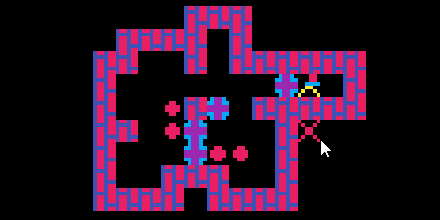

# soniper ([DEMO](https://abagames.github.io/soniper/))

Drag a crate to a destination position. A warehouse keeper searches a route and moves automatically.

## Acknowledgement

Level generator is based on the [Sokoban Generator](http://ianparberry.com/research/sokoban/).
